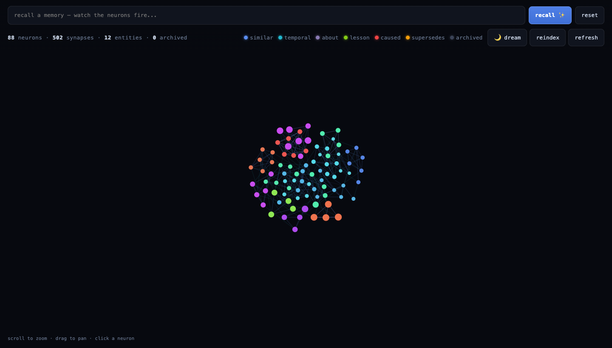

<div align="center">


<h1>engram</h1>

<b>Plug-and-play associative memory for any AI agent.</b>

<p>
<i>Hybrid recall · associative graph · spreading activation · dreaming · recall@k eval<br/>
offline by default · zero API keys to start · the whole index in one SQLite file</i>
</p>

[](LICENSE)


</div>

---

Agents are great at logging what happened and terrible at recalling it. **`engram`
fixes the recall half.** Point it at a folder of markdown notes (or `add()` memories
programmatically), and it gives any agent fast, ranked, *explainable* recall over
everything it has ever written — with zero external services and zero API keys
required to get started.

> All four layers of the design ship today: **hybrid retrieval** (semantic +
> lexical) over a **SQLite + FTS5** index, an **associative graph** with
> spreading-activation recall, **"dreaming"** consolidation (short-term ⇄
> long-term), and **reinforcement + recall@k eval**. The index is a rebuildable
> cache on top of your existing files — your markdown stays the source of truth.

```bash
npm install
npm run build
node dist/cli.js index ./sample-memories --fresh
node dist/cli.js recall "why did production go down after a release?"
```

```text
Top 3 memories for: "why did production go down after a release?"

1. [score 0.0400] Production broke once when a deploy shipped application code that
   expected a new column before the database migration had run...
   ↳ semantic #1 (0.21) · lexical #1 · importance 0.90 · semantic/deploy-rollback-rule.md
```

It surfaced the right memory even though the query never said "migration" or
"rollback." **That is the whole point.**

---

## ✨ Features

| | |
|---|---|
| 🔀 **Hybrid recall** | Semantic (vector cosine) **+** lexical (SQLite FTS5/bm25), fused with Reciprocal Rank Fusion — robust without score normalisation. |
| 🕸️ **Associative recall** | A typed graph of edges (causal, temporal, entity, similarity) **+ spreading activation**: a hit *charges* its neighbours, so recall surfaces a relevant memory the keyword/vector pool never contained. Pass `{ associative: true }`. |
| 🌙 **Short-term → long-term** | Promotion lifts memories *proven useful* (recalled repeatedly) into a durable, **protected** tier; consolidation cold-archives the noise. One `mem.dream()` runs the whole cycle on a cron. |
| 🪟 **Live dashboard, built in** | `engram dashboard` serves a zero-setup neuron-graph visualiser — type a query and **watch the neurons fire**, tinted by emotion, with dream / reindex / explore controls. No external services. |
| 🎨 **Affect-aware tagging** | Memories are tagged from a **comprehensive human-emotion palette** (130+ feelings across joy, love, awe, grief, fear, anger, shame, nostalgia…), so recall and the dashboard can reason and colour by how a memory *felt*. |
| 💪 **Reinforcement + eval** | Hebbian edge strengthening on co-recall, plus a built-in **recall@k** evaluator and weight tuner to measure and improve retrieval. |
| 🔌 **Zero-dependency by default** | An offline, deterministic hashing embedder — no API keys, no network, no native model. Great for tests, demos, and air-gapped agents. |
| 🧩 **Pluggable everything** | Swap embeddings (OpenAI built-in, or any model via a one-method interface). Use the **Claude/ChatGPT CLI subscription you already pay for** to rerank, tag, and infer edges — no API key. |
| 📄 **Markdown-native** | Frontmatter parsing, recursive walk, smart auto-chunking, and **incremental** indexing that only re-embeds changed content. |
| 🔎 **Explainable** | Every result carries a `why` trace (`semantic #1 · lexical #2 · importance 0.90`). Recall you can audit. |
| 💾 **One file = the whole index** | A single SQLite file you can copy, back up, or delete and rebuild. Tiny surface: one `Engram` class, a small CLI, no framework. |

---

## 📦 Install

engram ships from GitHub. Add it straight to your project from the git URL — the
`prepare` step compiles `dist/` on install, so the import just works:

```bash
npm install github:anmolmoses/engram-memory
# or pin a tag/commit:  npm install github:anmolmoses/engram-memory#v0.1.0
```

```ts
import { Engram } from "engram-memory";
```

Or clone it to hack on / run the CLI locally:

```bash
git clone https://github.com/anmolmoses/engram-memory.git && cd engram-memory
npm install        # runs the build via the prepare script
npm test           # 77 tests, runs offline
```

Requires **Node ≥ 20**. The only runtime dependency is `better-sqlite3`.

---

## 🚀 Library usage

```ts
import { Engram } from "engram-memory";

const mem = new Engram({ dbPath: "agent-memory.db" });

// 1. Index a folder of notes (non-destructive; rebuildable cache).
await mem.indexDirectory("./memories");

// 2. ...or add memories directly.
await mem.add({
  content: "Prod broke when the deploy raced ahead of the DB migration.",
  tier: "episodic",
  importance: 9,            // 1..10 or 0..1, auto-normalised
});

// 3. Recall the most relevant memories for the current situation.
const hits = await mem.recall("what should I watch out for when deploying?", { k: 5 });

// 3b. ...or recall associatively — let a hit charge its graph neighbours, so
//     related-but-not-keyword-matching memories surface too.
const linked = await mem.recall("deploying", { k: 5, associative: true });

// 4. Drop them straight into your prompt.
const context = mem.toContextBlock(hits);

mem.close();
```

### 🌙 Maintenance — one call, on a cron

```ts
// Nightly: promote proven memories to long-term, then forget the noise.
mem.dream({ consolidate: { capacity: 5000 } });
```

`dream()` runs the whole short-term/long-term cycle in the right order —
promotion first (so memories that earned their keep become protected), then
consolidation (archive the low-salience remainder), sharing one clock. Promotion
runs by default; consolidation only archives once you give it a `capacity`. Pass
`{ promote: false }` or `{ consolidate: false }` to run just one half. **That's the
only operational call a plug-and-play deployment needs.**

The same instance also exposes each piece directly if you want finer control:
`mem.buildEdges()` / `mem.buildLlmEdges()` (associative graph), `mem.consolidate()`
and `mem.promote()` (the two halves of `dream()`), `mem.graphExport()` (for
visualisation), `mem.recallTrace()` (the activation path behind a result), and
`mem.surprise()` / `mem.reinforce()` (novelty + Hebbian strengthening).

See [`examples/agent-integration.md`](examples/agent-integration.md) for the
per-turn agent loop and how to expose memory as model tools.

### Upgrading to true semantic recall

The default embedder is lexical-ish (it has no learned semantics — "car" and
"automobile" don't converge). For real semantic recall, pass a provider:

```ts
const mem = new Engram({
  dbPath: "agent-memory.db",
  embedding: { provider: "openai", model: "text-embedding-3-small" }, // uses OPENAI_API_KEY
});
```

Or implement the `EmbeddingProvider` interface (`{ name, dim, embed(texts) }`) for a
local model, Cohere, Voyage, etc. Nothing else in your code changes.

---

## 🔑 Use your existing subscription (no API key)

engram can use the **Claude or ChatGPT subscription you already pay for** — via
their command-line tools — to *rerank* recalled memories (and optionally rate
importance, tag, and infer edges). It shells out to `claude -p` or `codex exec`;
no API key, no separate billing.

```ts
const mem = new Engram({
  dbPath: "agent-memory.db",
  llm: { provider: "claude-cli", model: "sonnet" },      // your Claude subscription
  // llm: { provider: "codex-cli", model: "gpt-5-codex" }, // your ChatGPT/Codex subscription
});

const hits = await mem.recall("what bit us last release?", { k: 5, rerank: true });
```

How rerank works: hybrid search produces a larger candidate pool (cheap, local),
then the LLM **reads the actual text and reorders by true relevance**. On any
failure it falls back to the hybrid order — reranking never makes recall worse.

| Provider | Subscription | Models (`--llm-model`) | Prereq |
|----------|--------------|------------------------|--------|
| `claude-cli` | Claude (Max/Pro) | `sonnet`, `opus`, `haiku`, or full id | `claude` logged in |
| `codex-cli` | ChatGPT/Codex | `gpt-5-codex`, etc. | `codex login` + readable `~/.codex` |
| `command` | anything | n/a | any text-in/out CLI (e.g. `ollama run llama3`) |

---

## 🖥️ CLI

```bash
engram index <dir>        # index .md/.txt files (--fresh, --incremental, --llm-edges)
engram recall "<query>"   # -k N, --tier T, --rerank, --associative, --json, --mark-used
engram add "<text>"       # --tier, --importance, --source
engram graph              # export the associative graph (nodes + edges) as JSON
engram tag "<text>"       # tier/importance/emotion/topic/people as JSON (needs --llm)
engram dream              # nightly maintenance: promote proven memories, then consolidate
engram promote            # lift proven memories short-term -> long-term (--dry-run to preview)
engram eval <file.json>   # score recall@k against a labelled set
engram dashboard          # serve the live neuron-graph visualiser (--port, --host)
engram stats              # index statistics
engram help
```

Common flags: `--db <path>` (or `$ENGRAM_DB`), `--config <path>`,
`--provider hashing|openai`, `--model`, `--dim`, `--openai-key`.
LLM flags: `--llm claude|codex|none`, `--llm-model <name>`, `--tmux`, `--rerank`.

---

## 🪟 Dashboard

engram ships its own visualiser — **no extra setup, no external services**. Point
it at your index and open the URL:

```bash
engram dashboard --db agent-memory.db    # → http://127.0.0.1:7755
```

<div align="center">

</div>

Each memory is a **neuron**, each edge a **synapse**, tinted by the emotion the
memory carries. Type a query and the neurons that recall fires light up — seeds
glow brightest, then activation spreads along the graph. Scroll to zoom, drag to
pan, click a neuron to inspect it; the `dream` / `reindex` buttons run maintenance
live. It's also embeddable in your own app:

```ts
import { Engram, startDashboard } from "engram-memory";

const mem = new Engram({ dbPath: "agent-memory.db" });
startDashboard(mem, { port: 7755 });   // serves the same UI + JSON API
```

---

## 🧠 How it works

On ingest, each memory is embedded and stored in SQLite, with its text mirrored
into an FTS5 table. On `recall(query)`, two channels run: **semantic** (cosine of
the query embedding vs every stored vector) and **lexical** (FTS5/bm25 keyword
match). The two ranked lists are fused with **Reciprocal Rank Fusion**
(`score += weight / (k + rank)`), then nudged by **importance** and **recency**.
In associative mode the hybrid hits seed **spreading activation** across the graph
— charge flows along typed edges, attenuating each hop — so memories related by
*meaning and structure*, not just words, light up too. The top-k come back with a
`why` trace. Full details in
[`docs/paper/06-hybrid-retrieval.md`](docs/paper/06-hybrid-retrieval.md).

### What's inside

The full design ships in four layers. Each is independently usable and degrades
gracefully — no LLM, no network, and no graph are all valid configurations.

1. **Recall** — hybrid semantic + lexical retrieval over SQLite/FTS5, fused with
   Reciprocal Rank Fusion and nudged by importance/recency. The foundation.
2. **Associative graph** — typed edges between memories (similarity, entity,
   temporal, and LLM-inferred causal/supersedes/lesson_from) with
   spreading-activation recall (`{ associative: true }`).
3. **Dreaming** — short-term/long-term memory management in one call. `dream()`
   (CLI `engram dream`) promotes memories proven useful by repeated recall into a
   durable, protected tier, then consolidates — scoring salience and
   cold-archiving the noise.
4. **Reinforcement & eval** — Hebbian edge strengthening on co-recall, a recall@k
   evaluator, and a weight tuner to measure and improve retrieval.

Design write-up, layer by layer, in [`docs/paper/`](docs/paper). Known limits and
what's next: [`docs/paper/09-limitations-and-roadmap.md`](docs/paper/09-limitations-and-roadmap.md).

---

## 🗂️ Project structure

```text
engram/
  src/
    engram.ts            # the public Engram orchestrator
    index.ts             # public API exports
    cli.ts               # command-line interface
    config.ts            # engram.config.json loader
    store/               # SQLite + FTS5 storage (swappable behind MemoryStore)
    embeddings/          # pluggable providers (hashing default, openai optional)
    llm/                 # subscription-CLI providers (claude, codex, command)
    ingest/              # markdown frontmatter + chunking
    retrieval/           # hybrid RRF fusion, LLM rerank, spreading activation
    graph/               # associative edges (similarity, entity, LLM-inferred)
    enrich/              # memory tagging + the human-emotion palette
    consolidation/       # "dreaming" — salience scoring, promotion, cold-archive
    eval/                # recall@k evaluation + weight tuning
    dashboard/           # self-contained neuron-graph visualiser (page + server)
    util/                # hashing, cosine, frontmatter, tokenisation
  test/                  # node:test suites (offline)
  examples/              # quickstart + integration guide
  sample-memories/       # works out of the box
  docs/paper/            # research-paper-style design documentation
```

---

<div align="center">

Grounded in the agent-memory literature (Generative Agents' recency/importance/relevance
scoring; hybrid vector+lexical retrieval as used by Mem0/Zep).

**MIT** licensed — see [LICENSE](LICENSE).

</div>
